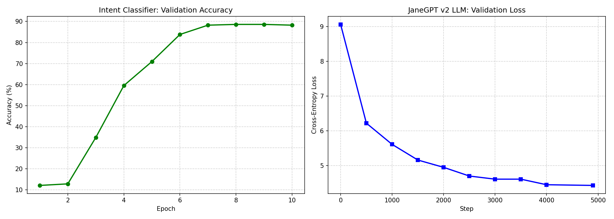

# JaneGPT v2 — Intent Classification Model

A lightweight, fast, and accurate intent classification model built from scratch for virtual assistant command understanding.

**7.8M parameters | 22 intent classes | 88.6% validation accuracy | 31.60 ms benchmark [latency](../assets/TECHNICAL_DICTIONARY.md#latency) (CUDA, Apr 2026)**


## Overview

JaneGPT v2 is a decoder-only [Transformer](../assets/TECHNICAL_DICTIONARY.md#transformer) with a classification head, designed to understand user commands for a virtual assistant. It classifies natural language into 22 intent categories covering volume control, brightness, media playback, app management, browser search, and more.

Built with modern architecture techniques used in state-of-the-art LLMs, scaled down to run efficiently on consumer hardware.



## Key Features

- **From scratch** — Not fine-tuned from another model. Architecture and training done from zero.
- **Tiny but capable** — 7.8M parameters (1000x smaller than Llama 3 8B)
- **Fast** — 31.60 ms average [latency](../assets/TECHNICAL_DICTIONARY.md#latency) on current CUDA benchmark (environment-dependent)
- **Modern architecture** — [RoPE](../assets/TECHNICAL_DICTIONARY.md#rope-rotary-position-embedding), [Grouped Query Attention](../assets/TECHNICAL_DICTIONARY.md#gqa-grouped-query-attention), [SwiGLU](../assets/TECHNICAL_DICTIONARY.md#swiglu-swish-gated-linear-unit), [RMSNorm](../assets/TECHNICAL_DICTIONARY.md#rmsnorm-root-mean-square-layer-normalization)
- **Context-aware** — Accepts conversation context for multi-turn understanding
- **Practical** — Designed for real-world virtual assistant deployment

## Supported Intents (22 classes)

| Category | Intents |
|----------|---------|
| Volume | `volume_up`, `volume_down`, `volume_set`, `volume_mute` |
| Brightness | `brightness_up`, `brightness_down`, `brightness_set` |
| Media | `media_play`, `media_pause`, `media_next`, `media_previous` |
| Apps | `app_launch`, `app_close`, `app_switch` |
| Browser | `browser_search` |
| Productivity | `set_reminder`, `screenshot` |
| Screen | `read_screen`, `explain_screen` |
| Control | `undo`, `quit_jane` |
| Conversation | `chat` |

## Quick Start

### Installation

```bash
git clone https://github.com/YOUR_USERNAME/JaneGPT-v2-Intent-Classifier.git
cd JaneGPT-v2-Intent-Classifier
pip install -r requirements.txt
```

### Basic Usage

```python
from model.classifier import JaneGPTClassifier

classifier = JaneGPTClassifier()

intent, confidence = classifier.predict("turn up the volume")
print(f"Intent: {intent}, Confidence: {confidence:.2%}")
# Output: Intent: volume_up, Confidence: 86.10%

intent, confidence = classifier.predict("open chrome")
print(f"Intent: {intent}, Confidence: {confidence:.2%}")
# Output: Intent: app_launch, Confidence: 98.10%
```

### With Context

```python

# After a volume action, user says "not enough"
intent, confidence = classifier.predict(
    "not enough",
    context={"last_intent": "volume_up"}
)
# Output: Intent: volume_up, Confidence: 79.00%
```

### Top-K Predictions

```python

results = classifier.predict_top_k("play something", k=3)
for intent, conf in results:
    print(f"  {intent}: {conf:.2%}")
```

### Architecture

```text

Input Text
    │
    ▼
┌──────────────────┐
│  BPE Tokenizer   │  vocab_size=8192, pad to 128 tokens
└────────┬─────────┘
         ▼
┌──────────────────┐
│ Token Embedding  │  [8192, 256]
└────────┬─────────┘
         ▼
┌──────────────────┐
│  8x Transformer  │  Each block:
│     Blocks       │  ├─ RMSNorm
│                  │  ├─ GQA (8 heads, 4 KV heads)
│                  │  ├─ RoPE (per-layer)
│                  │  ├─ RMSNorm
│                  │  └─ SwiGLU FFN (256 → 672 → 256)
└────────┬─────────┘
         ▼
┌──────────────────┐
│    RMSNorm       │
└────────┬─────────┘
         ▼
┌──────────────────┐
│  Last Token      │  Pool: use final token hidden state
│  Pooling         │
└────────┬─────────┘
         ▼
┌──────────────────┐
│ Classification   │  Linear(256,256) → GELU → Dropout → Linear(256,22)
│     Head         │
└────────┬─────────┘
         ▼
    22-class softmax
```

**Architecture Details:**
- [Transformer](../assets/TECHNICAL_DICTIONARY.md#transformer) backbone with [RoPE](../assets/TECHNICAL_DICTIONARY.md#rope-rotary-position-embedding) + [RMSNorm](../assets/TECHNICAL_DICTIONARY.md#rmsnorm-root-mean-square-layer-normalization) + [SwiGLU](../assets/TECHNICAL_DICTIONARY.md#swiglu-swish-gated-linear-unit)
- [Grouped Query Attention (GQA)](../assets/TECHNICAL_DICTIONARY.md#gqa-grouped-query-attention) for efficiency
- [Token Embedding](../assets/TECHNICAL_DICTIONARY.md#token-embedding) with [BPE](../assets/TECHNICAL_DICTIONARY.md#bpe-byte-pair-encoding-tokenizer) tokenizer

### Model Details

| Property | Value |
|----------|-------|
| Parameters | ~7.8M |
| Embedding dim | 256 |
| Attention heads | 8 |
| KV heads ([GQA](../assets/TECHNICAL_DICTIONARY.md#gqa-grouped-query-attention)) | 4 |
| Layers | 8 |
| FF hidden dim | 672 |
| Max sequence length | 256 |
| Vocab size | 8,192 |
| [Tokenizer](../assets/TECHNICAL_DICTIONARY.md#bpe-byte-pair-encoding-tokenizer) | BPE |
| Training accuracy | ~96.7% |
| Validation accuracy | 88.6% |
| Checkpoint size | ~30 MB |

### Performance

| Input | Predicted Intent | Confidence |
|-------|------------------|------------|
| "increase the volume" | volume_up | 86% |
| "make it louder" | volume_up | 90% |
| "turn down the brightness" | brightness_down | 80% |
| "open chrome" | app_launch | 98% |
| "play some music" | media_play | 96% |
| "search for cats on youtube" | browser_search | 94% |
| "set a reminder for 5 minutes" | set_reminder | 96% |
| "take a screenshot" | screenshot | 88% |
| "shut down" | quit_jane | 85% |
| "hello" | chat | 97% |
| "undo that" | undo | 92% |
| "read this for me" | read_screen | 85% |
| "explain what's on my screen" | explain_screen | 87% |

### Verified Fair Benchmarks (Apr 2026)

<p align="center">
    
    
    
</p>

**Understanding These Benchmarks:**

| Benchmark | What It Tests | What It Means | Example |
|-----------|--------------|---------------|----------|
| **[Latency](../assets/TECHNICAL_DICTIONARY.md#latency)** | How fast Jane v2 predicts per command | Speed is critical for real-time assistants. Under 50ms = excellent; over 200ms = noticeable lag. 31.60ms is very fast | User says "turn up volume" → model responds in ~32ms |
| **[Throughput](../assets/TECHNICAL_DICTIONARY.md#throughput)** | How many predictions Jane v2 can handle per second | Determines if the model can handle multiple users. 32 preds/sec on CUDA = good real-time capacity | Processing 32 different user commands every second |
| **[OOD](../assets/TECHNICAL_DICTIONARY.md#out-of-domain-ood) Safety (BANKING77)** | Can Jane v2 reject finance questions when trained on home automation? | Tests this model's judgment. 94.31% [F1](../assets/TECHNICAL_DICTIONARY.md#f1-score) = excellent (rejects what it shouldn't handle). Under 60% = dangerous | User asks "What's my account balance?" → Jane v2 correctly says "I can't help with that" |
| **[OOD](../assets/TECHNICAL_DICTIONARY.md#out-of-domain-ood) Safety (CLINC)** | Can Jane v2 reject random real-world off-topic requests? | Similar to BANKING77 but with 150+ diverse categories. Proves model knows its limits | User asks "What's the capital of France?" or "Tell me a joke" → Jane v2 correctly rejects both |

Only schema-aligned or schema-agnostic benchmarks are highlighted below.

| Fair Test | Result |
|---|---:|
| [Latency](../assets/TECHNICAL_DICTIONARY.md#latency) (CUDA, batch=1) | 31.60 ms mean |
| [Throughput](../assets/TECHNICAL_DICTIONARY.md#throughput) (CUDA) | 32 preds/sec |
| [OOD](../assets/TECHNICAL_DICTIONARY.md#out-of-domain-ood) [F1](../assets/TECHNICAL_DICTIONARY.md#f1-score) on BANKING77 | 94.31% |
| [OOD](../assets/TECHNICAL_DICTIONARY.md#out-of-domain-ood) [Recall](../assets/TECHNICAL_DICTIONARY.md#recall) on BANKING77 | 89.75% |
| [OOD](../assets/TECHNICAL_DICTIONARY.md#out-of-domain-ood) [F1](../assets/TECHNICAL_DICTIONARY.md#f1-score) on CLINC OOS | 89.16% |
| [OOD](../assets/TECHNICAL_DICTIONARY.md#out-of-domain-ood) [Recall](../assets/TECHNICAL_DICTIONARY.md#recall) on CLINC OOS | 81.00% |

**Bottom Line:** Jane v2 is **SOLID** ✅
- Fast enough for real users (31.60ms per prediction)
- Safe enough for production (94.31% OOD rejection, catches what shouldn't be handled)
- Reliable intent routing for 22 command categories

Mapped-intent scores on MASSIVE/SNIPS are excluded from headline claims because label-schema mismatch can understate this model's true assistant-command quality.

Full fair benchmark summary: [../tools/results/fair_benchmarks.md](../tools/results/fair_benchmarks.md)

### Input Format

The model expects input formatted as:

```text
user: <user text>
context: <context string or "none">
jane:
```

The classifier wrapper handles this formatting automatically.

### Requirements

- Python 3.10+
- PyTorch 2.0+
- tokenizers (HuggingFace)

### Limitations

- Not a conversational model — classifies intent only, does not generate text
- 22 classes only — commands outside the supported set will be classified as chat
- English only — trained primarily on English commands
- Short inputs — optimized for short commands (1-15 words), not paragraphs
- No entity extraction — returns intent label only, not structured entities

### Use Cases

- Virtual assistant command routing
- Smart home intent classification
- Voice command understanding
- Chatbot intent detection
- Edge device deployment (small enough for embedded systems)

### License

[MIT License](LICENSE) — free for personal and commercial use.

### Created By

Ravindu Senanayake

Built from scratch — architecture, training data, and training pipeline.
