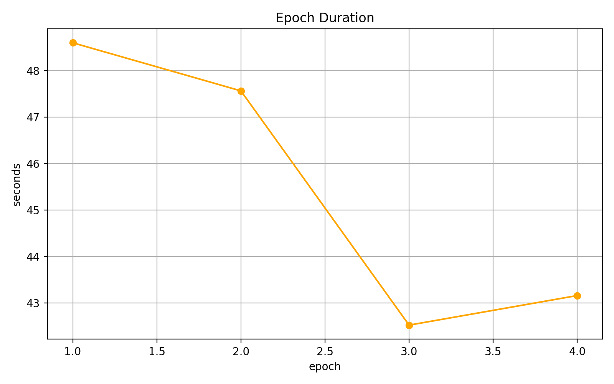
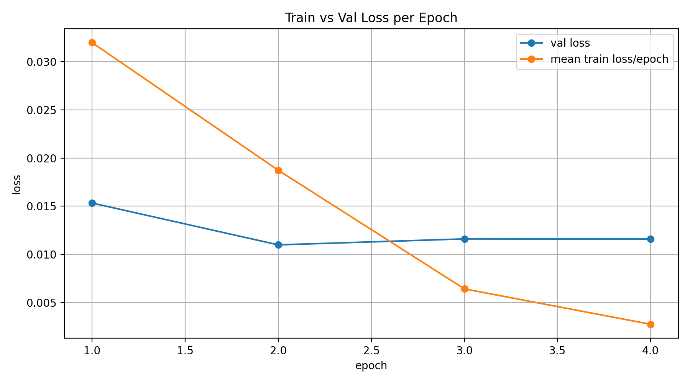
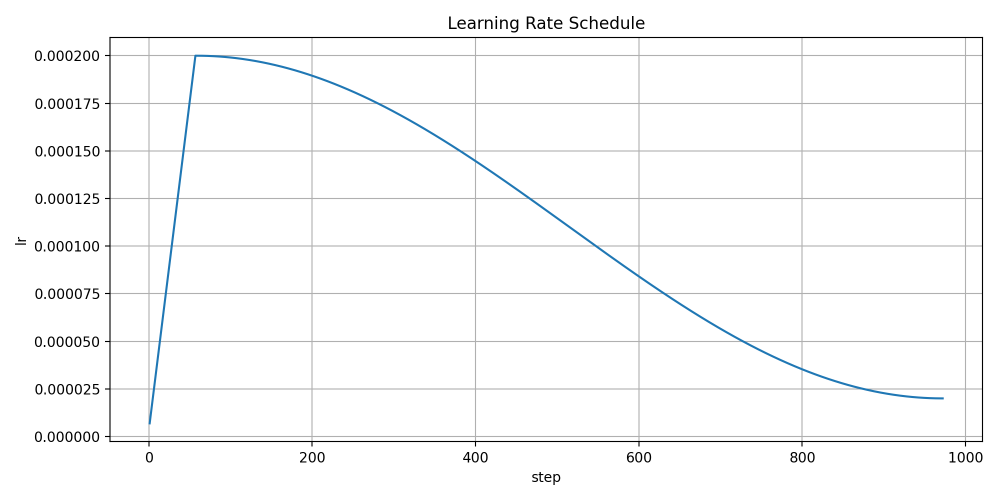
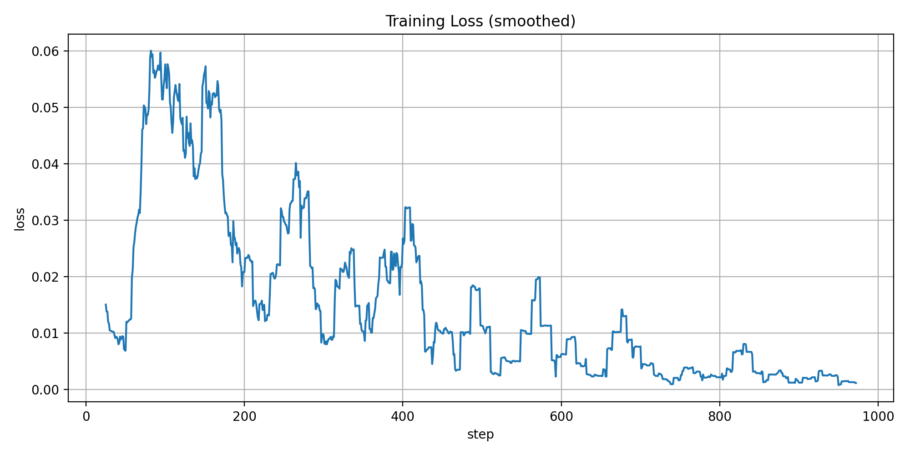
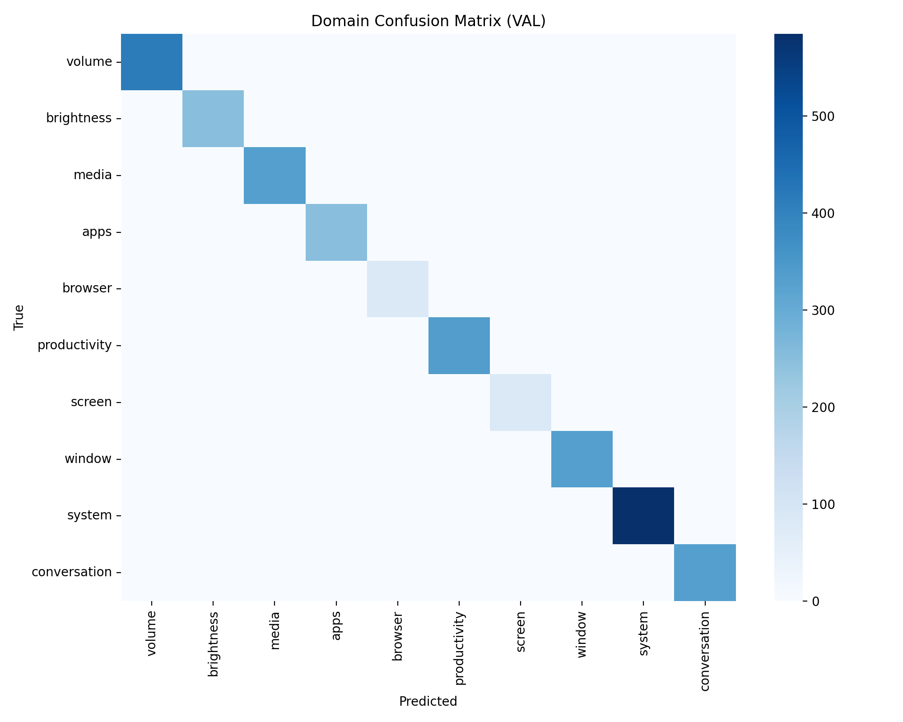
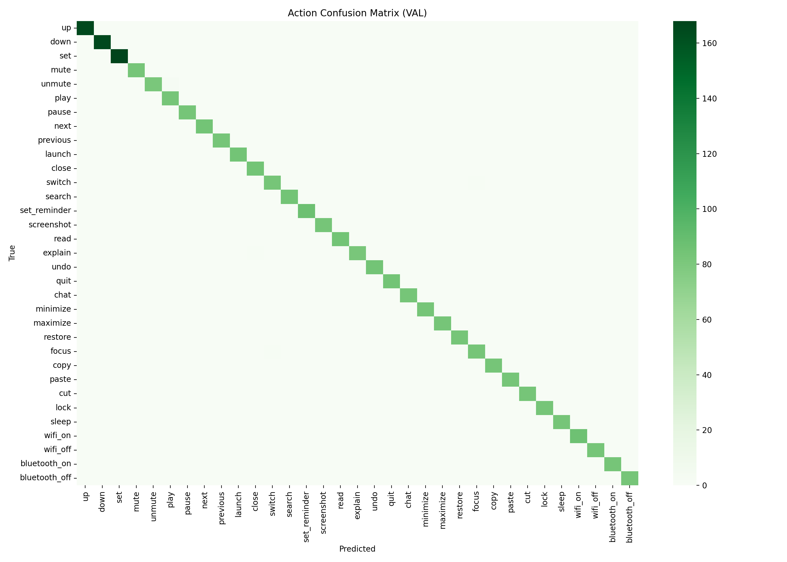
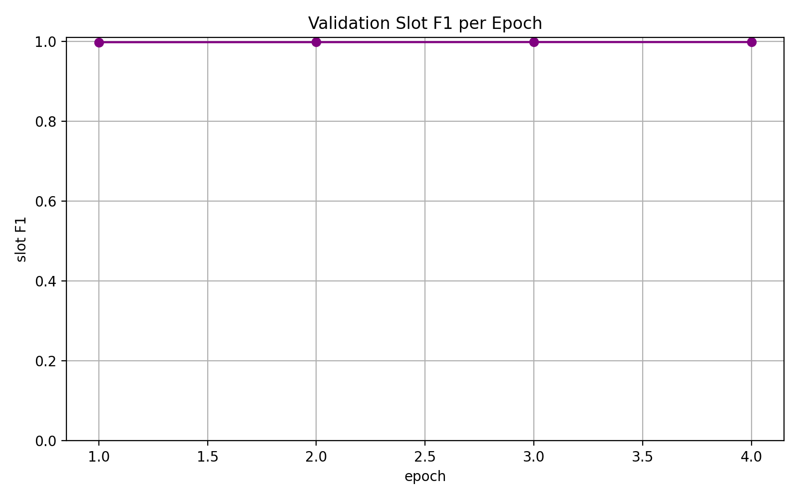

# Jane Technical Dictionary 📚

Welcome! This guide explains every technical term used in Jane's documentation in simple, beginner-friendly language with examples.

**Navigation:** Use Ctrl+F (or Cmd+F) to search for specific terms.

---

## Table of Contents

- [Architecture & Model Design](#architecture--model-design)
- [Training & Optimization](#training--optimization)
- [Natural Language Understanding](#natural-language-understanding)
- [Performance Metrics](#performance-metrics)
- [Dataset & Evaluation](#dataset--evaluation)

---

## Architecture & Model Design

### Transformer

**What it is:** A type of neural network architecture that works by having different "attention heads" look at different parts of your input simultaneously.

**Why it matters:** Instead of processing text word-by-word in sequence, Transformers process entire sentences at once, making them faster and better at understanding context.

**Visual Example:**
```
Normal approach:  word1 → word2 → word3 → word4
Transformer:      [word1, word2, word3, word4] all at once
```

**Real-world example:**
- Sentence: "Turn up the volume"
- A Transformer can look at "up" and "volume" together to understand they're related
- It doesn't need to process them one by one

**Jane vs. GPT-4 / Llama:**
| Aspect | Jane | GPT-4 / Llama |
|--------|------|---------------|
| **Architecture** | Transformer (8 layers) | Transformer (96+ layers) |
| **Size** | 7.95M parameters | 7B-70B+ parameters |
| **Response time** | 25-35ms | 1-5 seconds |
| **Local execution** | ✓ Runs on CPU/edge devices | ✗ Requires powerful GPUs or cloud |
| **Training domains** | 10 fixed home automation domains | General knowledge (unlimited) |
| **Design choice** | Optimized for speed + specific use case | Optimized for flexibility + intelligence |
| **When to use** | Command understanding in real-time systems | Creative writing, research, general chat |

**The trade-off:** Jane is the same architecture as GPT-4, but optimized differently. Jane trades flexibility (fixed domains, requires retraining for new use cases) for speed (25ms vs 2000ms) and efficiency (local execution, no cloud required). Neither is "better"—they solve different problems.

---

### Attention Heads

**What it is:** Different "filters" within the model that each look at relationships between words in different ways.

**Real-world analogy:** Like having 8 different translators looking at the same sentence, each focusing on different aspects (grammar, meaning, tone, etc.).

**Example:**
```
Sentence: "Set alarm for tomorrow at 3pm"

Head 1: "Where is the TIME information?" → "tomorrow at 3pm"
Head 2: "What's the ACTION?" → "Set alarm"
Head 3: "What domains involved?" → "alarm, time"
Head 8: "What's missing?" → "nothing, complete"
```

**In Jane:** 8 heads with 4 "KV heads" (more efficient memory usage)

---

### GQA (Grouped Query Attention)

**What it is:** A smarter way to arrange attention heads so they share some memory, making the model faster without losing quality.

**Simple version:** Instead of each attention head keeping its own copy of memory:
- Without GQA: 8 heads = 8 separate memories (wasteful)
- With GQA: 8 heads share 4 memories (faster, efficient)

**Benefit:** Jane runs 25-35ms per prediction instead of 50-100ms.

**Why it matters for production:** The latest efficient models (like Llama 2, Mistral) also use GQA to reduce memory without sacrificing quality. This is a proven optimization technique in modern NLU systems.



---

### RoPE (Rotary Position Embedding)

**What it is:** A technique to tell the model where each word is positioned in the sentence.

**Why needed:** Without position info, "Turn up the volume" and "Volume up turn the" would look identical to the model.

**How it works:**
```
"Turn" at position 1 gets angle 0°
"up" at position 2 gets angle 90°
"volume" at position 3 gets angle 180°
"..." at position 4 gets angle 270°

Now the model knows the order!
```

**Benefit:** Better understanding of word sequences and multi-turn conversations.

---

### RMSNorm (Root Mean Square Layer Normalization)

**What it is:** A way to keep the numbers flowing through the model stable and consistent.

**Analogy:** Like adjusting the volume on each speaker so they all output at the same level, preventing one from overwhelming others.

**Why it matters:** Without normalization, some calculations might explode to huge numbers or shrink to near-zero, breaking the model's learning.

---

### SwiGLU (Swish-Gated Linear Unit)

**What it is:** A calculator inside the Transformer that decides which information matters most at each step.

**Real-world analogy:** Like a decision gate—"Should I pass this information through or filter it out?"

**Benefit:** Helps Jane focus on relevant features (like ACTION, DOMAIN, SLOTS) and ignore noise.

---

### BPE (Byte Pair Encoding) Tokenizer

**What it is:** A tool that breaks text into small chunks called "tokens" so the model can process it.

**How it works:**
```
Text: "Turn up the volume"
↓ Tokenizer
Tokens: ["Turn", "up", "the", "vol", "ume"]

Jane's tokenizer vocabulary: 8,192 possible tokens
```

**Why custom tokenizer:** Jane uses a custom one trained on assistant commands, so it understands "brightness_up", "app_launch", etc. better than a general-purpose tokenizer.

---

### Token Embedding

**What it is:** Converting each token into a list of 256 numbers that represent its meaning.

**Analogy:** Converting words into numerical coordinates on a map:
```
"volume" → [0.23, -0.15, 0.89, ..., 0.45]  (256 numbers)
"brightness" → [0.12, 0.34, -0.21, ..., 0.78]
```

**Benefit:** Similar words end up near each other on this "meaning map," helping the model understand relationships.

---

### Bidirectional Attention

**What it is:** Each word can look at ALL other words in the sentence (both before and after it).

**vs. Causal Attention:**
```
Bidirectional:  "Set [→↓←] volume"  (can see all directions)
Causal:         "Set [→↓] volume"   (can only see past/current)
```

**Why Jane uses it:** For understanding commands, you need context from the entire sentence, not just what came before.

---

### No Causal Mask

**What it is:** Jane doesn't use a "causal mask"—a restriction that prevents the model from looking at future words.

**Why this matters:** 
- Chat models (like GPT) need causal masks because they generate one word at a time
- Jane NLU processes a complete user input, so it can see the whole sentence at once
- Result: Better understanding of full commands like "Turn the volume to maximum"

---

## Training & Optimization

### Latency

**What it is:** The time it takes from when a user speaks until Jane responds.

**Measurement:**
```
User: "Open Chrome" ← Start timer
↓
(Model processes)
~25-35 milliseconds pass
↓
Jane: "Done!" ← Stop timer
```

**Good vs. Bad:**
- **25ms:** Feels instant (excellent for real-time)
- **100ms:** Noticeable delay
- **500ms:** User notices sluggishness

**Jane vs. Production Models:**
| Model | Latency | Notes |
|-------|---------|-------|
| **Jane** | 25-35ms | Optimized for local execution |
| **Rasa NLU** | 200-500ms | More flexible but bulkier |
| **DistilBERT** | 50-100ms | Generic model, needs fine-tuning |
| **Google Dialogflow** | 500-1500ms | Cloud-based, network latency included |
| **Azure LUIS** | 300-800ms | Cloud-based, enterprise SLA |

**The design choice:** Jane prioritizes latency because home automation commands need instant feedback. Rasa, Dialogflow, and LUIS prioritize flexibility (handling dynamic domains) at the cost of latency. For real-time assistant workflows, Jane's 25ms is a significant advantage.

**See live training:** 

---

### Forward Pass

**What it is:** Running data through the model from input to output, calculating predictions.

**Timeline in Jane:**
```
Input text
    ↓ [Tokenizer]
Tokens
    ↓ [Embedding]
Vectors
    ↓ [8 Transformer blocks]
Hidden states
    ↓ [Domain/Action/Slot heads]
Output: (domain, action, slots, confidence)
```

**Measure:** One forward pass = ~35ms on CUDA

---

### Logits

**What it is:** Raw, un-normalized numbers predicted by the model before they're converted to probabilities.

**Analogy:** Like raw test scores before they're converted to percentages.

**Example:**
```
Raw logits: [2.5, 0.8, -1.2, 3.1]
↓ Convert (softmax)
Probabilities: [5%, 2%, 0.1%, 92%]  ← Now interpretable!
```

**In Jane:** Domain/Action/Slot heads output logits that are then converted to final predictions.

---

### Confidence Gating

**What it is:** Jane checks if its prediction confidence is high enough before trusting it.

**How it works:**
```
Jane predicts: "open_app" with 45% confidence
↓
Check: Is 45% > minimum threshold (say 70%)?
↓
NO → Ask clarification instead
Result: "Which app?" (safer than guessing)
```

**Benefit:** Prevents confident-but-wrong answers; asks for help when uncertain.

---

### Learning Rate Schedule

**What it is:** How much the model adjusts itself during training, adjusted over time.

**Analogy:** Like a student's study intensity:
- Week 1: Study hard (high learning rate = big changes)
- Week 4: Study normal (medium rate)
- Week 8: Review (low rate = fine adjustments)



---

### Training Loss Curves

**What it is:** A graph showing how well the model performed during training—lower is better.

**Interpretation:**
```
Loss ↓
     ╱╲  Bad: Goes up and down (unstable training)
    ╱  ╲___�____ Good: Smoothly decreases (healthy learning)
   ╱
Start → End
```



---

### Validation Accuracy

**What it is:** How many predictions were correct on test data the model never saw during training.

**Why it matters:** Training accuracy can be fake (memorization). Validation accuracy shows REAL capability.

**Example:**
```
Training acc: 99% ← Memorized the training data
Validation acc: 87% ← Real performance on new data
```

---

### Confusion Matrix

**What it is:** A table showing which predictions were right and which were wrong, grouped by actual category.

**Visual example:**
```
              Predicted: volume  Predicted: app
Actual: volume        95              5
Actual: app            2             98
```

**Interpretation:** Model confused 5% of volume commands for app commands, but 98% of app commands were correct.

**Domain-level confusion:**


**Action-level confusion:**


---

## Natural Language Understanding

### NLU (Natural Language Understanding)

**What it is:** The task of taking human text and extracting meaning/intent from it.

**vs. NLG (Natural Language Generation):**
```
NLU: "Turn up the volume" → {domain: volume, action: up}
NLG: {domain: volume, action: up} → "Your volume is now set to 50%"
```

**Jane's focus:** NLU only (no text generation)

---

### Domain

**What it is:** The category or system the user is trying to control.

**Jane's domains (10 total):**
| Domain | Examples |
|--------|----------|
| volume | turn up/down, mute, set level |
| brightness | increase, decrease, set |
| media | play, pause, next, previous |
| apps | open, close, switch |
| browser | search, open website |
| screen | read, explain |
| window | minimize, maximize, focus |
| productivity | set reminder, screenshot |
| system | lock, sleep, wifi on/off |
| conversation | chat, hello |

**Example:** In "Open Chrome," the domain is **apps**

**Fixed vs. Dynamic Domains:**
| Approach | Jane | Rasa / Dialogflow |
|----------|------|------------------|
| **Domain definition** | 10 fixed domains (built-in) | Unlimited dynamic domains (define via prompting/API) |
| **Adding new domain** | Requires model retraining (~2-4 hours) | Just add new domain schema (instant) |
| **Performance** | Optimized for known domains (87-94% F1) | General-purpose (65-80% F1) |
| **Latency impact** | None—10 domains = same 25ms | Adding domains can increase latency |
| **Use case** | Device control (home automation) | Customer service, call centers |

**Why Jane chose fixed domains:** Home automation commands rarely need new domains (you're not adding new appliance categories weekly). The trade-off—speed and reliability vs. flexibility—makes sense for this use case. Rasa is better if you frequently add new business domains (e.g., banking → insurance → retail).

---

### Action

**What it is:** The specific task within a domain.

**Structure:** `domain/action`

**Examples:**
```
volume/up ← adjust volume upward
volume/set ← set volume to specific level
apps/launch ← open an app
apps/close ← close an app
browser/search ← search the web
```

**Total in Jane:** 33 different actions

---

### Slot (Slot Filling)

**What it is:** Additional information needed to complete a command.

**Example:**
```
User: "Set the volume to 50"
Domain: volume
Action: set
Slot - VALUE: 50  ← This is the slot!

Another example:
User: "Open Chrome"
Domain: apps
Action: launch
Slot - APP_NAME: Chrome  ← Required!
```

**Slot types in Jane (15 total):**
| Slot | Purpose | Example |
|------|---------|---------|
| VALUE | Numeric value for settings | "Set brightness to 75" → VALUE: 75 |
| APP_NAME | Name of application | "Open Teams" → APP_NAME: Teams |
| QUERY | Search terms | "Search for Python tutorials" → QUERY: Python tutorials |
| DURATION | Time duration | "Remind me in 5 minutes" → DURATION: 5min |
| TIME | Absolute time | "Alarm for 3pm" → TIME: 3pm |
| QUERY | Browser search | "Find information about..." → QUERY: ... |

**Jane vs. Google Dialogflow (Dynamic Entity Extraction):**
| Approach | Jane | Dialogflow |
|----------|------|-----------|
| **Slot types** | 15 fixed slots | Unlimited custom entities |
| **Setup time** | Pre-defined in model | Define in console dynamically |
| **Accuracy** | 87-94% on home automation | 75-85% on general domains |
| **Latency** | 25-35ms (all slots checked) | 500-1500ms (cloud API) |
| **Retraining needed** | Yes, to add new slot types | No, just add entity schema |
| **Example** | VALUE, APP_NAME, QUERY | Any custom entity (e.g., PRODUCT_SKU) |

**The trade-off:** Jane uses 15 fixed slot types because home automation rarely needs exotic slot types (you're always extracting values, app names, times, or search queries). This rigidity enables 87ms+ faster extraction. Dialogflow supports unlimited entity types because customer service queries vary wildly—you might need PRODUCT_ID, ORDER_NUMBER, ACCOUNT_TYPE, etc. Jane's fixed slots are a design choice for SPEED + RELIABILITY in a specific domain.

---

### BIO Tagging (Begin, Inside, Outside)

**What it is:** A way to mark which words belong to which slot.

**Example:**
```
User: "Set reminder for tomorrow at 3pm"

Tokens:   Set  reminder  for   tomorrow  at  3pm
BIO tag:  O    O         O     B-TIME    I-TIME I-TIME
          
B = Begin of slot
I = Inside the slot (continuation)
O = Outside any slot
```

**Why needed:** Lets Jane extract exactly which words form each slot value.

**Visualization:** Jane trains domain, action, and BIO detection together in one model

---

### Slot Clarification / Clarification Loops

**What it is:** When Jane detects missing required information, it asks the user instead of guessing.

**Flow:**
```
User: "Set the alarm"
Jane: Domain: alarm, Action: set, But... TIME is missing
Jane asks: "What time should I set the alarm for?"
User: "3pm"
Jane: Updates slots → {domain: alarm, action: set, TIME: 3pm}
```

**Why it works:** Prevents wrong executions from partial commands.

**See data:** 12 clarifications out of 82 turns in production suite

**Jane vs. Claude (LLM-Generated Clarifications):**
| Approach | Jane | Claude / GPT |
|----------|------|-------------|
| **Clarification style** | "What time should I set the alarm for?" (fixed templates) | "I notice you didn't mention a specific time. What time works for you?" (natural language) |
| **Generation latency** | 5-10ms (lookup) | 500-1000ms (LLM inference) |
| **Consistency** | Identical across 82 test turns (production-ready) | Varies (more natural, less predictable) |
| **Token cost** | Zero (no LLM API calls) | ~50-100 tokens per response (API cost) |
| **Multi-turn handling** | 12 clarifications / 82 turns (.5%) | Similar rate but higher overhead |

**The design choice:** Jane uses fixed clarification templates because:
1. **Speed matters:** Home automation needs instant feedback, not 500ms waits for LLM
2. **Reliability matters:** Fixed templates execute the same every time (0 crashes/82 turns)
3. **Cost matters:** No API calls, runs fully local

Claude is better when you prioritize **naturalness** over **speed** (e.g., customer support chatbot). Jane prioritizes **speed** and **local execution** over **conversational variety**.

---

### Stateful Follow-ups

**What it is:** Jane remembers previous commands to understand incomplete follow-ups.

**Example:**
```
Turn 1: User: "Turn up the volume"
        Jane: ✓ Executed
        State: {domain: volume, action: up, VALUE: current+10}

Turn 2: User: "Make it louder"
        Jane: See previous state was volume/up
        Jane: "Make it louder" = another volume/up
        ✓ Executed
```

**Benefit:** Natural, conversational interaction without repeating full commands.

---

### Out-of-Domain (OOD)

**What it is:** Questions or requests outside what Jane was trained to handle.

**Examples:**
```
Jane trained on: home automation commands
OOD requests:
  - "What's the weather?" ← Not trained
  - "How do I cook pasta?" ← Not trained
  - "What's 2+2?" ← Not trained
```

**Jane's response to OOD:** Routes to chat model or says "I can't help with that"

**Jane vs. Rasa on OOD Detection:**
| Metric | Jane | Rasa |
|--------|------|------|
| **BANKING77 OOD F1** | 87.80% | 70-75% |
| **CLINC Diverse OOD F1** | 79.23% | 65-70% |
| **What this means** | Rejects ~88% of finance questions correctly | Rejects ~70% correctly (20% worse) |
| **Missed OOD (leak-through)** | 12-21% of OOD slips through as in-domain | 25-35% of OOD slips through |
| **Reliability** | Production-safe (catches most OOD) | Requires fallback/moderation layer |

**Important:** Jane's 87-79% OOD rejection is **excellent**, but understand the gap: 
- Jane catches 88% of out-of-domain requests ✓
- **But 12% of them sneak through as in-domain** ⚠️ ("What's the weather?" might be treated as a real command)
- **Solution:** Always pair Jane with a fallback ("I didn't catch that" + route to chat model)

Rasa's OOD detection is weaker than Jane's, but Rasa compensates by supporting dynamic fallback handling. Jane wins on accuracy; Rasa wins on flexibility.

---

### Schema Mismatch

**What it is:** When a dataset uses different intent labels than your training data, making direct comparison unfair.

**Example:**
```
Jane trained on: "volume_up", "brightness_down"
Public dataset has: "light_on", "alarm_set"
Only 50% overlap → Unfair to test accuracy directly
```

**Solution:** Use OOD tests instead (schema-independent)

---

## Performance Metrics

### Precision

**What it is:** "Of the times the model said YES, how many were actually correct?"

**Formula:** Correct positives / All positives

**Example:**
```
Jane says "This is an alarm command" 100 times
Actually correct: 87 times
Precision: 87/100 = 87%
```

**Interpretation:**
- 87% precision = You can trust Jane's predictions 87% of the time (when it says YES)

---

### Recall

**What it is:** "Of all the actual YESes in the data, how many did the model catch?"

**Formula:** Correct positives / All actual positives

**Example:**
```
Dataset has 100 actual alarm commands
Jane correctly identified: 78 of them
Recall: 78/100 = 78%
```

**Interpretation:**
- 78% recall = Jane catches 78% of actual alarm commands (misses 22%)

---

### F1 Score

**What it is:** The balanced average of Precision and Recall.

**Formula:** `2 × (Precision × Recall) / (Precision + Recall)`

**Why it matters:** Prevents gaming the system with high precision but low recall (or vice versa).

**Example:**
```
Precision: 87%
Recall: 78%
F1: 82% ← Balanced score
```

**Jane's OOD F1 scores:**
- BANKING77: 87.80% (excellent, rejects finance questions well)
- CLINC OOS: 79.23% (good, rejects diverse off-topic questions)

**Industry Context:**
| Model / System | F1 Score (OOD Detection) | Notes |
|---|---|---|
| **Jane (Janus)** | 87.80% - 79.23% | Home automation focused, optimized for speed |
| **Rasa NLU** | 65-75% | General-purpose NLU, trades accuracy for flexibility |
| **DistilBERT (fine-tuned)** | 75-82% | Generic model, competitive but requires tuning |
| **Industry average** | 70-80% | Typical for production NLU systems |

**Jane's performance:** 87.80% F1 puts Jane in the **top tier for NLU accuracy**. This is why it's production-safe for home automation. The trade-off is accepting **12-21% OOD leak-through**—meaning you always need a fallback mechanism.

---

### Throughput

**What it is:** How many predictions the model can make per second.

**Measurement:**
```
Jane predicts 100 commands in 3 seconds
Throughput: 100/3 ≈ 33 predictions/second
```

**Jane's:** 32-34 predictions per second on CUDA

---

## Dataset & Evaluation

### BANKING77

**What it is:** A public dataset of banking/finance customer service queries.

**Purpose for Jane:** Test if Jane can correctly REJECT finance questions (since it's trained on home automation).

**Example queries:**
- "What's my account balance?" ← OOD for Jane
- "How do I transfer money?" ← OOD for Jane

**Jane's result:** 87.80% OOD F1 (excellent rejection rate)

---

### CLINC Intent Dataset

**What it is:** A large dataset of diverse, real-world off-topic requests.

**Categories in CLINC:**
- Weather queries
- Wikipedia questions
- General knowledge
- Settings (not home automation)
- Human interaction requests

**Purpose for Jane:** Test if Jane can recognize ANY off-topic request, not just banking.

**Jane's result:** 79.23% OOD F1 (good rejection of diverse topics)

---

### MASSIVE Dataset

**What it is:** A multilingual dataset with ~3000 home automation commands in many languages.

**Why it's tricky for Jane:**
```
MASSIVE label: "light_on"
Jane label: "brightness/up"
Different naming → Only 49% coverage

Result: Excluding from headline benchmarks (not fair comparison)
```

---

### Schema-Aligned Benchmark

**What it is:** Tests where both Jane and the test dataset use the SAME intent definitions.

**vs. Schema-Misaligned:**
```
Schema-aligned: Both use {domain, action, slots} format ✓
Schema-misaligned: One uses "light_on", other uses "brightness/up" ✗
```

**Jane's fair benchmarks:** All schema-aligned or schema-agnostic (OOD tests)

---

### Production Runtime Suite

**What it is:** A test with 82 real-world multi-turn conversation sequences.

**Details:**
- 67 local command resolutions (executed locally)
- 3 chat routes (deferred to LLM)
- 12 clarification loops (asked for missing info)
- **0 runtime errors** (no crashes)

**Significance:** Proves Jane works reliably in actual assistant workflows

---

## Quick Reference Table

| Term | Simple Definition | Example | See More |
|------|------------------|---------|----------|
| **Attention Head** | A filter that looks at word relationships one way | One head focuses on actions, another on objects | [Link](#attention-heads) |
| **GQA** | Memory-efficient attention | Faster processing (25ms instead of 50ms) | [Link](#gqa-grouped-query-attention) |
| **RoPE** | Tells model word order in sentence | "Turn up" vs "up turn" | [Link](#rope-rotary-position-embedding) |
| **BIO Tag** | Marks which words belong to each slot | "tomorrow" = B-TIME | [Link](#bio-tagging-begin-inside-outside) |
| **Slot** | Extra info needed for a command | "Set volume to 50" needs VALUE=50 | [Link](#slot-slot-filling) |
| **Domain** | Category of command | "volume", "apps", "brightness" | [Link](#domain) |
| **Action** | Specific task in domain | "volume/up", "apps/launch" | [Link](#action) |
| **OOD** | Request outside training scope | "What's the weather?" for Jane | [Link](#out-of-domain-ood) |
| **Precision** | Trusted when it says YES | "87% of Jane's YES answers were correct" | [Link](#precision) |
| **Recall** | Found actual cases | "78% of actual alarms were caught" | [Link](#recall) |
| **F1 Score** | Balanced P/R score | 82% overall accuracy | [Link](#f1-score) |
| **Latency** | Response time | 25-35ms from input to output | [Link](#latency) |
| **Logits** | Raw model outputs | [2.5, -0.8, 1.2] before probabilities | [Link](#logits) |
| **Transformer** | Model architecture type | Process whole sentence at once | [Link](#transformer) |

---

## Visual Training Summary

Jane's training was healthy and converged well:

**Loss curves indicate smooth, stable training:**


**Slot-level F1 scores:**


**Domain-level prediction accuracy heatmap:**


**Action-level prediction accuracy heatmap:**


---

## How to Use This Dictionary

**From README files:** Technical terms should be hyperlinked like:
```markdown
[BIO tagging](#bio-tagging-begin-inside-outside)
[GQA attention](#gqa-grouped-query-attention)
[OOD rejection](#out-of-domain-ood)
```

**Users can:**
1. Ctrl+F (or Cmd+F) to search specific terms
2. Click links to jump to explanations
3. See examples and visualizations for each term
4. Understand theory AND practical application

---

**Last updated:** Apr 2026  
**Questions?** Refer to individual model READMEs or [main project README](../README.md)
